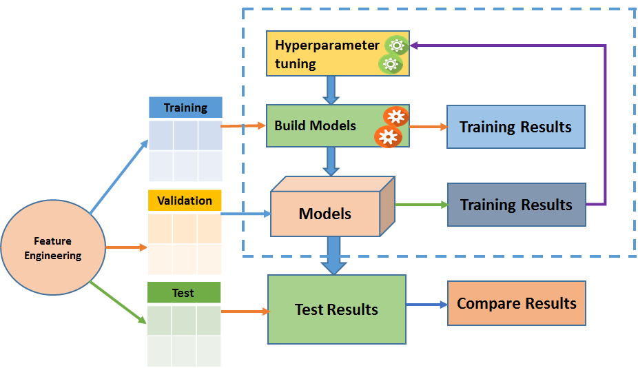
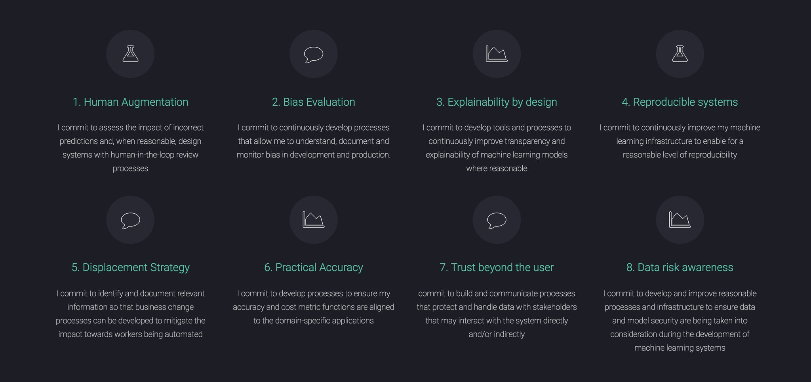

<!-- .slide: data-background="images/network-background.jpg" class="background" -->

<h2>The Institute for Ethical AI & ML</h2>
<h4>A practical framework for Responsible ML</h4>

   
   
    Alejandro Saucedo   
    <a href="http://twitter.com/AxSaucedo">@AxSaucedo</a> 
    <a href="http://linkedin.com/in/AxSaucedo">in/axsaucedo</a> 
   

[NEXT]
<!-- .slide: data-background="images/network-background.jpg" class="background" -->
<h2>The Institute for Ethical AI & ML</h2>
<h4>A practical framework for Responsible ML</h4>

<table class="bio-table">
  <tr>
    <td style="float: left">
        
         
        Alejandro Saucedo
         
         
    </td>
    <td style="float: left; color: white; font-size: 0.7em;">

         
        Chairman
         
        <a style="color: cyan" href="http://ethical.institute">The Institute for Ethical AI & ML</a>
         
         
        Chief Engineer & Scientist
         
        <a style="color: cyan" href="http://e-x.io">Exponential</a>
         
         
        AI Fellow / Member
         
        <a style="color: cyan" href="#">The RSA & EU AI Alliance</a>
         
         
        Advisor
         
        <a style="color: cyan" href="http://teensinai.com">TeensInAI.com initiative</a>
         
         
        
    </td>
  </tr>
  <tr>
  </tr>
</table>

[NEXT]
<!-- .slide: data-background="images/network-background.jpg" class="background smallquote" -->

## A practical framework for Responsible ML

> Motivations
>  
>  
> Overview of Institute
>
> Responsible AI Framework
> 
> Next steps!

[NEXT]
<!-- .slide: data-background="images/particles.gif" class="background smallquote" -->

# #LetsDoThis

[NEXT SECTION]
<!-- .slide: data-background="images/parti.png" class="background smallquote" style="color: white" -->

# 1. Motivations

[NEXT]
<!-- .slide: data-background="images/parti.png" class="background smallquote" style="color: white" -->
Traditional data science generalised in two workflows

* Model Development
* Model Serving

[NEXT]
<!-- .slide: data-background="images/parti.png" class="background smallquote" style="color: white" -->

If we have a small team or a small/simple project...
## We can cope with the issues

[NEXT]
<!-- .slide: data-background="images/parti.png" class="background smallquote" style="color: white" -->

* Small number of models to maintain
* Data scientists have knowledge of models in their head
* They each have their methods for tracking their progress

 
### It all works relatively well!

[NEXT]
<!-- .slide: data-background="images/parti.png" class="background smallquote" style="color: white" -->

# However
As our data science requirements grow...
## We face new issues

[NEXT]
<!-- .slide: data-background="images/parti.png" class="background smallquote" style="color: white" -->
#### Increasing complexity in flow of data

    <ul>
        <li>Large number of data processing workflows</li>
        <li>Data is modified without stardardised trace</li>
        <li>Managing complexity of flows and scheduling becomes unmanagable</li>
    </ul>

[NEXT]
<!-- .slide: data-background="images/parti.png" class="background smallquote" style="color: white" -->
#### Each data scientist has their own set of tools

    <ul>
        <li>Some ♥ Tensorflow</li>
        <li>Some ♥ R</li>
        <li>Some ♥ Spark</li>
    </ul>

 
### Some ♥ all of them

[NEXT]
<!-- .slide: data-background="images/parti.png" class="background smallquote" style="color: white" -->

#### Serving models becomes increasinly harder

    <ul>
        <li>Different model versions running in different environments</li>
        <li>Deploying and reverting models gets increasingly complex</li>
    </ul>

[NEXT]
<!-- .slide: data-background="images/parti.png" class="background smallquote" style="color: white" -->
#### When stuff goes wrong it's hard to trace back

    <ul>
        <li>Data scientists say it's a bug in the pipelines</li>
        <li>Data engineers say it's something wrong in the models</li>
        <li>Becomes a cat-and-mouse game</li>
    </ul>

[NEXT]
<!-- .slide: data-background="images/parti.png" class="background smallquote" style="color: white" -->

# Luckily for us
Many fellow colleagues have faced these issues for a while

and an active problem that many people are trying to address

[NEXT]
<!-- .slide: data-background="images/parti.png" class="background smallquote" style="color: white" -->

#### Data Scientists 
In charge of development of models
 
 

#### Data Engineers 
In charge of development of data pipelines
 
 

### DevOps / DataOps / MLOps Engineers
In charge of productionisation of models, data pipelines & products

[NEXT]
<!-- .slide: data-background="images/parti.png" class="background smallquote" style="color: white" -->

### As your technical functions grow...

[NEXT]
<!-- .slide: data-background="images/parti.png" class="background smallquote" style="color: white" -->

### So should your infrastructure

[NEXT]
<!-- .slide: data-background="images/parti.png" class="background smallquote" style="color: white" -->

## EuroSciPy Talk 2018
<h1 style="color: white !important">MLOps / DataOps</h1>
<h4>a curated list of frameworks to scale  your machine learning capabilities </h4>

   
  <a style="color:#00ffda" href="http://bit.ly/awesome-mlops">bit.ly/awesome-mlops</a>
   
   

[NEXT SECTION]
<!-- .slide: data-background="images/partistat.png" class="background smallquote" style="color: white" -->

# 2. The ML Principles

[NEXT]
<!-- .slide: data-background="images/partistat.png" class="background smallquote" style="color: white" -->

#### The Institute for Ethical AI & ML
<iframe style="height: 50vh; width: 100vw" src="http://ethical.institute"></iframe>
#### <a href="http://ethical.institute">http://ethical.institute</a>

[NEXT]
<!-- .slide: data-background="images/partistat.png" class="background smallquote" style="color: white" -->
## The moral-consciousness matrix

| | | |
| - | - | - |
| | Conscious | Unconscious | 
| Moral | 🤩| 🤨 |
| Immoral | 👹| 🤪 |
| | | |

 
<h3>Moral === Wants to do good</h3>
<h3>Conscious === Knows how to</h3>

[NEXT]
<!-- .slide: data-background="images/partistat.png" class="background smallquote" style="color: white" -->

## IEML phased rollout plan
* **Phase 1 - Responsible ML by pledge**
    * For technologists to implement  
* **Phase 2 - Responsible ML by process**
    * For technology leaders to introduce  
* **Phase 3 - Responsible ML by certification**
    * For industries to raise the bar  
* **Phase 4 - Responsible ML by regulation**
    * For economies to thrive

[NEXT]
<!-- .slide: data-background="images/partistat.png" class="background smallquote" style="color: white" -->
# Phase 1
## Our 3 core streams

* The 8 Machine Learning Principles
* Open source contributions (i.e. MLOps List)
* The Ethical ML Network of technologists

[NEXT]
<!-- .slide: data-background="images/partistat.png" class="background smallquote" style="color: white" -->
## The 8 ML Principles

####  <a href="http://ethical.institute/principles.html">ethical.institute/principles.html</a>

[NEXT]
<!-- .slide: data-background="images/partistat.png" class="background smallquote" style="color: white" -->

## 1. Human augmentation

 

Assess impact of incorrect predictions

and design with human-in-the-loop review

where reasonable

<!-- .element: class="fragment fade-out" data-fragment-index="1" -->

<ul>
    <li>Sentence prediction</li>
    <li>Fraud detection</li>
    <li>Temporary augmentation</li>
</ul>
<!-- .element: class="fragment fade-in" data-fragment-index="1" -->

[NEXT]
<!-- .slide: data-background="images/partistat.png" class="background smallquote" style="color: white" -->

## 2. Bias evaluation

 

Non-trivial decisions have 
inherent societal bias.
We should identify, document
bias and implications

<!-- .element: class="fragment fade-out" data-fragment-index="1" -->

<ul>
    <li>Data bias</li>
    <li>Feature importance</li>
    <li>Equity vs Equality</li>
</ul>
<!-- .element: class="fragment fade-in" data-fragment-index="1" -->

[NEXT]
<!-- .slide: data-background="images/partistat.png" class="background smallquote" style="color: white" -->

## 3. Explainable by design

 

Explainability through domain knowledge,
together with feature importance analysis

<!-- .element: class="fragment fade-out" data-fragment-index="1" -->

<ul>
    <li>Accuracy-explainability tradeoff</li>
    <li>Modularisation of elements</li>
    <li>Domain knowledge as features</li>
</ul>
<!-- .element: class="fragment fade-in" data-fragment-index="1" -->

[NEXT]
<!-- .slide: data-background="images/partistat.png" class="background smallquote" style="color: white" -->

## 4. Reproducible systems

Abstracting computations
to improve reproducibility
in development and production

<!-- .element: class="fragment fade-out" data-fragment-index="1" -->

<!-- .element: class="fragment fade-in" data-fragment-index="1" -->

[NEXT]
<!-- .slide: data-background="images/partistat.png" class="background smallquote" style="color: white" -->

## 5. Displacement strategy

Identifying and documenting
impact of technology towards
workers being displaced

<!-- .element: class="fragment fade-out" data-fragment-index="1" -->

<ul>
    <li>Reducing impact</li>
    <li>Jevons paradox</li>
    <li>Business change strategies</li>
</ul><!-- .element: class="fragment fade-in" data-fragment-index="1" -->

[NEXT]
<!-- .slide: data-background="images/partistat.png" class="background smallquote" style="color: white" -->

## 6. Practical accuracy
 

Taking a pragmatic approach 
towards accuracy and cost metrics

<!-- .element: class="fragment fade-out" data-fragment-index="1" -->

<ul>
    <li>Going beyond accuracy</li>
    <li>Domain specific metrics</li>
    <li>In development and production</li>
</ul><!-- .element: class="fragment fade-in" data-fragment-index="1" -->

[NEXT]
<!-- .slide: data-background="images/partistat.png" class="background smallquote" style="color: white" -->

## 7. Trust beyond the user

Build 
processes to 
use and protect 
user data & privacy,
and 
make sure they are communicated

<!-- .element: class="fragment fade-out" data-fragment-index="1" -->

<ul>
    <li>Privacy at the right level</li>
    <li>Metadata via personal data</li>
    <li>Communicating when reasonable</li>
</ul><!-- .element: class="fragment fade-in" data-fragment-index="1" -->

[NEXT]
<!-- .slide: data-background="images/partistat.png" class="background smallquote" style="color: white" -->

## 8. Data Risk Awareness

Develop processes and infrastructure
to ensure data and model security 
are taken into consideration

<!-- .element: class="fragment fade-out" data-fragment-index="1" -->

<ul>
    <li>Security breaches due to human error</li>
    <li>Adversarial attacks</li>
    <li>Social engineering new processes</li>
</ul>
<!-- .element: class="fragment fade-in" data-fragment-index="1" -->

[NEXT]
<!-- .slide: data-background="images/partistat.png" class="background smallquote" style="color: white" -->

## Join the Ethical ML Network

<iframe style="height: 50vh; width: 100vw" src="http://ethical.institute"></iframe>
####  <a href="http://ethical.institute">ethical.institute</a>

[NEXT]
<!-- .slide: data-background="images/partistat.png" class="background smallquote" style="color: white" -->

# Next steps

Applying this thinking into your actual projects 

## #LetsDoThis

[NEXT SECTION]
<!-- .slide: data-background="images/network-background.jpg" class="background smallquote" -->
# 3. Wrapping up

[NEXT]
<!-- .slide: data-background="images/network-background.jpg" class="background smallquote" -->

## A practical framework for Responsible ML

> Motivations
>  
>  
> Overview of Institute
>
> Responsible AI Framework
> 
> Next steps!

[NEXT]
<!-- .slide: data-background="images/network-background.jpg" class="background" -->
## The ML Principles
ethical.institute/principles.html

## Awesome MLOps List
bit.ly/awesome-mlops

# Thank you
Questions? a@ethical.institute

